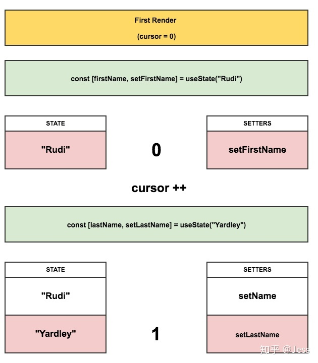

### React Hooks: 没有魔法，只是数组

### 理解hooks怎么运行
我听说很多同学都对hooks像魔法一般的效果感到困惑，因此我将尝试通过浅显的方式，来演示hooks是怎么运行的。

#### hooks的原则
react团队在怎么使用hooks的 官方文档 中，强调了两点主要的使用原则：

不要 在 循环、条件语句或者嵌套函数中调用hooks
只能在 React 函数组件中调用hooks
第二点我认为是显而易见的。为了给 函数组件 增加一些能力(比如 state，类声明周期方法)，你当然需要通过一种方式，来把这种能力赋给函数组件，这种方式就是使用hooks。

然而，第一点规则，很容易让人感到困惑。不就是使用一个 API 么，为什么还有这么多限制呢。这也正是我将要在下文里解释的。

#### hooks中的state管理，只是在操作数组
为了更加清晰的理解hooks，让我们来看看怎么简单实现hooks API。

请注意，下面代码只是一个demo，是为了让我们理解hooks大概是怎么运作的。这不是 React 中的真正内部实现。

#### 怎么实现 useState 呢？
让我们通过一个例子来演示，useState内部大概是怎么运作的。

组件代码如下：
```
function RenderFunctionComponent() {
  const [firstName, setFirstName] = useState("Rudi");
  const [lastName, setLastName] = useState("Yardley");

  return (
    <Button onClick={() => setFirstName("Fred")}>Fred</Button>
  );
}
```
useState 实现的功能是，你能通过这个hook返回的 数组 中第二个元素，作为修改这个state的一个setter方法。

### 那么，React可能会怎么来实现 useState 呢？
让我们来想想react内部会怎么来实现 useState 呢。在下面的实现里，state 是存放在被render的组件外面，并且这个state不会和其他组件共享，同时，在这个组件后续render中，能够通过特定的作用域方式，访问到这个state。

1) state初始化

创建两个空数组，分别用来存放 setters 和 state，将 指针 指到 0 的位置：


2) 组件首次render

当首次render这个函数组件的时候。

每一个 useState 调用，当 首次 执行的时候，在 setter 数组里加入一个 setter 函数(和对应的数组index关联)；然后，将 state 加入对应的 state 数组里：



3) 组件后续(非首次)render

后续组件的每次render，指针都会重置为 0 ，每调用一次 useState，都会返回指针对应的两个数组里的 state 和 setter，然后将指针位置 +1。


4)setter调用处理

每一个 setter 函数，都关联了对应的指针位置。当调用某个 setter 函数式，就可以通过这个函数所关联的指针，找到对应的 state，修改state数组里对应位置的值：


**最后来看看useState简单的实现**
```
let state = [];
let setters = [];
let firstRun = true;
let cursor = 0;

function createSetter(cursor) {
  return function setterWithCursor(newVal) {
    state[cursor] = newVal;
  };
}

// This is the pseudocode for the useState helper
export function useState(initVal) {
  if (firstRun) {
    state.push(initVal);
    setters.push(createSetter(cursor));
    firstRun = false;
  }

  const setter = setters[cursor];
  const value = state[cursor];

  cursor++;
  return [value, setter];
}

// Our component code that uses hooks
function RenderFunctionComponent() {
  const [firstName, setFirstName] = useState("Rudi"); // cursor: 0
  const [lastName, setLastName] = useState("Yardley"); // cursor: 1

  return (
    <div>
      <Button onClick={() => setFirstName("Richard")}>Richard</Button>
      <Button onClick={() => setFirstName("Fred")}>Fred</Button>
    </div>
  );
}

// This is sort of simulating Reacts rendering cycle
function MyComponent() {
  cursor = 0; // resetting the cursor
  return <RenderFunctionComponent />; // render
}

console.log(state); // Pre-render: []
MyComponent();
console.log(state); // First-render: ['Rudi', 'Yardley']
MyComponent();
console.log(state); // Subsequent-render: ['Rudi', 'Yardley']

// click the 'Fred' button

console.log(state); // After-click: ['Fred', 'Yardley']
```
### 为什么hooks的调用顺序不能变呢？
如果我们根据某些外部变量，或者组件自身的state，改变hooks的调用顺序，会有什么后果呢？

我们来演示下 **错误的** 做法：

```
let firstRender = true;

function RenderFunctionComponent() {
  let initName;

  if(firstRender){
    [initName] = useState("Rudi");
    firstRender = false;
  }
  const [firstName, setFirstName] = useState(initName);
  const [lastName, setLastName] = useState("Yardley");

  return (
    <Button onClick={() => setFirstName("Fred")}>Fred</Button>
  );
}
```
上面代码里，我们第一个 useState 是在一个 条件分支里。我们来看看这样引入的bug。

1) 第一次render


第一个render之后，我们的两个state，firstName 和 lastName 都对应了正确的值。接下来看看组件第二次render的时候，会发生什么情况。

2) 第二次render


第二次render之后，我们的两个state， firstName和 lastName 都成了 Rudi。这显然是错误的，必须要避免这样使用hooks！但是这也给我们演示了，hooks的调用顺序，为什么不能改变。

**react团队明确强调了hooks的2个使用原则，如果不按照这些原则来使用hooks，将会导致我们数据的不一致性！**

**将hooks的操作想象成数组的操作，你可能不太会违背这些原则**

OK，现在你应该清楚，为什么我们不能在条件块或者循环语句里调用hooks了。因为调用hooks的过程中，我们是在操作数组上的指针，如果你在多次render中，改变了hooks的调用顺序，将导致数组上的指针和组件里的 useState 不匹配，从而返回错误的 state 以及 setter 。

### 结论
希望我基本讲明白了，hooks调用顺序的大概原理。hooks是对react生态的一个很好的优化。人们对hooks感到兴奋，是有原因的。如果你将hooks的操作，当做数组一样来看待，那么你一般不会违背hooks的使用原则。

### 转载文章
[React hooks: not magic, just arrays](https://medium.com/@ryardley/react-hooks-not-magic-just-arrays-cd4f1857236e)

[React Hooks: 没有魔法，只是数组](https://zhuanlan.zhihu.com/p/66923924)